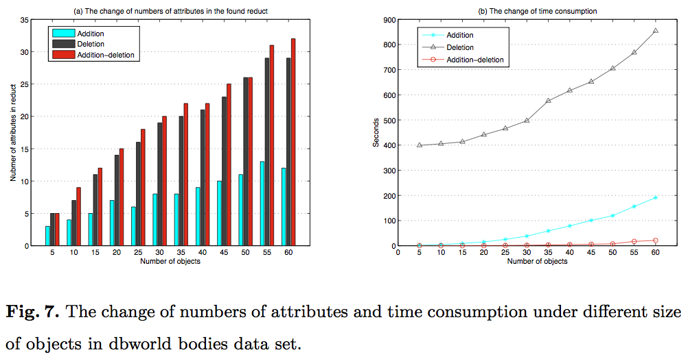
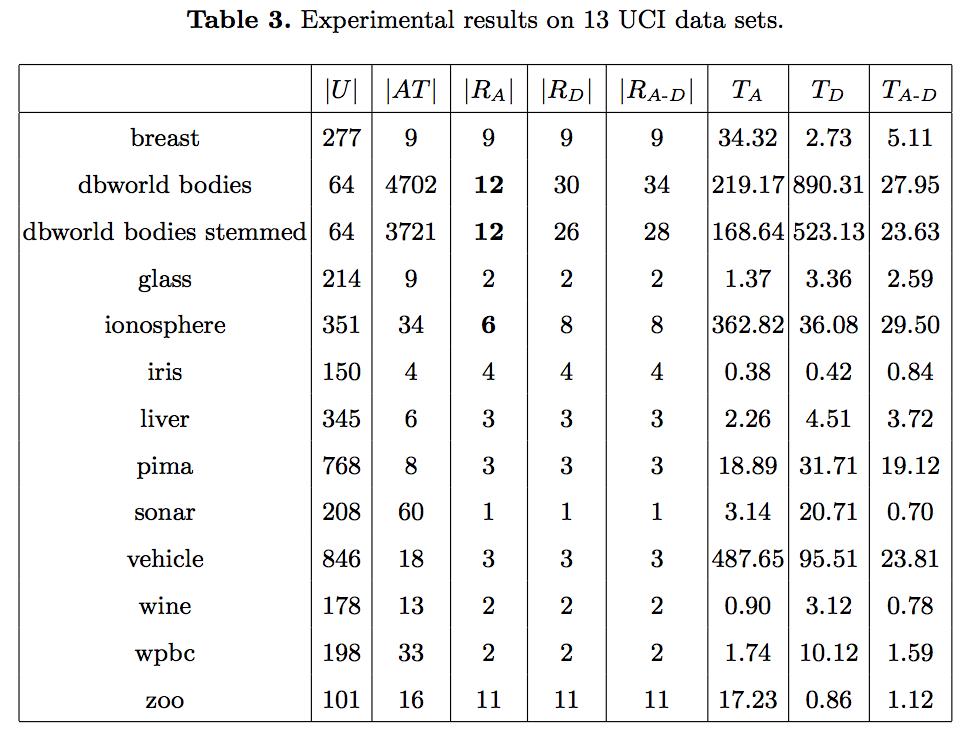

# RCAS

RCAS stands for Reduct Construction based on Addition Strategy which was proposed in my paper [An addition strategy for reduct construction](https://link.springer.com/chapter/10.1007/978-3-319-11740-9_49), but this repository includes Matlab implementation of all three types of attribute Reduct construction algorithms, i.e., Deletion based, Addition based, and Addition-deletion based algorithms.

Generally, attribute Reduct constructed based on Addition strategy algorithm will likely have less number of attributes than other existing methods, i.e., Deletion method and Addition-deletion method. This makes the Addition strategy significantly space friendly in big data situation.

In some cases when data has hundreds, even million attributes, such as DNA sequence reduction, Addition method is faster than other methods as most of attributes are redundant. In this respository, I also provided implementations of other algorithms and some experimental comparison results.

## Code of Three Algorithms
- Addition algorithm: [RCAAS.m](./rcas/RCAAS.m)
- Deletion algorithm: [RCDS.m](./rcas/RCDS.m)
- Addition-deletion algorithm: [RCADS.m](./rcas/RCADS.m)

## Some Experimental Results
- The change of numbers of attributes and time consumption under different size
of objects in dbworld bodies data set:

- Experimental results on 13 UCI data sets:

